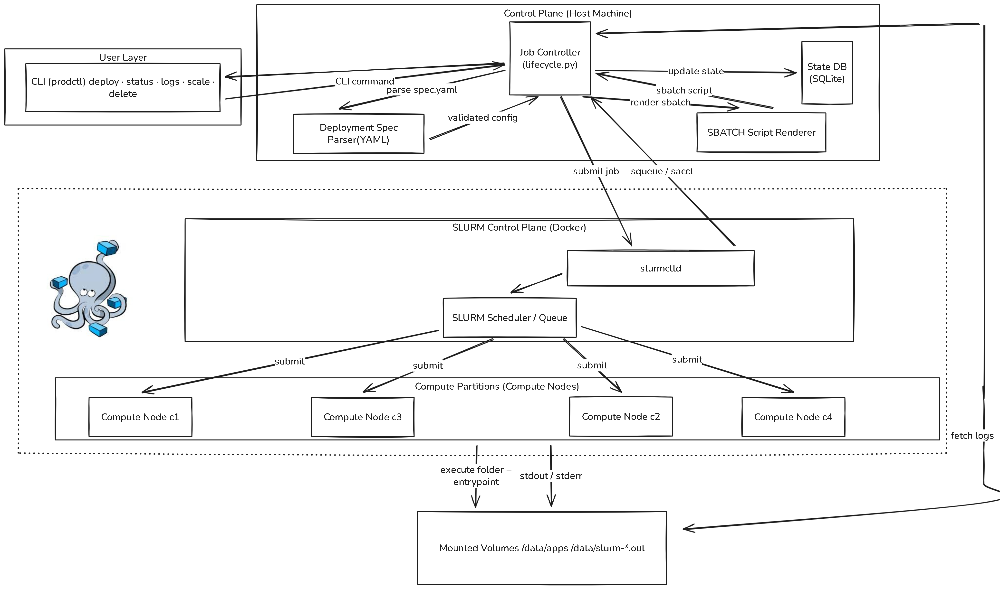

# Pathway – SLURM Job Deployment Prototype

This project is a lightweight **deployment controller** built on top of a **SLURM Docker cluster**.  
It demonstrates how to configure, deploy, monitor, scale, and collect logs for jobs executed on a SLURM-based compute cluster **without containers**, using a **folder + entrypoint** model.

This repository was developed as part of a technical assignment.

---

## 📁 Project Structure
```text
.
├── controller/              # Control plane (logic layer)
│   ├── config.py            # Paths and filesystem layout
│   ├── lifecycle.py         # Deploy / scale / delete logic
│   ├── render.py            # SBATCH script generator
│   ├── slurm.py             # SLURM CLI wrapper (sbatch, squeue, sacct)
│   └── state.py             # SQLite state database
│
├── jobs/
│   └── example_app/         # Example application (job = folder)
│       ├── app.py
│       └── run.sh           # Entrypoint
│
├── specs/
│   └── example-app.yaml     # Deployment specification
│
├── prodctl.py               # CLI entrypoint
├── requirements.txt
├── README.md
└── .gitignore
```

---

## 🧠 Architecture Overview



The system is split into clear layers:

### 1. User Layer
- CLI (`prodctl.py`)
- Commands: `deploy`, `status`, `logs`, `scale`, `delete`

### 2. Control Plane
- Parses deployment specs (YAML)
- Generates SBATCH scripts
- Tracks job state in SQLite
- Interacts with SLURM via CLI

### 3. SLURM Layer (Docker)
- `slurmctld` (scheduler)
- Compute nodes (`c1`, `c2`, `c3`, `c4`)
- Jobs executed via `sbatch`

### 4. Shared Storage
- `/data` directory shared across nodes
- Used for:
  - Application staging
  - Job logs
  - Runtime artifacts

---

## 📄 Deployment Specification (YAML)

Each job is described using a deployment spec.

**Example:**
```yaml
name: example-app
workdir: jobs/example_app
entrypoint: ./run.sh

resources:
  cpus: 1
  mem_mb: 512

replicas: 2

slurm:
  partition: normal
  time_limit: "00:10:00"

logs_dir: ".logs"
```

**What this config controls:**
- CPU / RAM
- Number of replicas
- Code location (folder = unpacked container)
- SLURM scheduling parameters
- Log locations

---

## 🚀 How It Works

### 1. Code Staging
- Job code is copied from host into `/data/apps/<app>/replica-<id>`
- `/data` is shared across all compute nodes
- No container runtime required

### 2. Job Submission
- An SBATCH script is generated dynamically
- Submitted using `sbatch` inside `slurmctld`
- Each replica is a separate SLURM job

### 3. State Tracking
- SQLite database tracks:
  - Job ID
  - Replica ID
  - Status
  - Log templates

### 4. Status Polling
- `squeue` used for running jobs
- `sacct` used for completed jobs

### 5. Log Collection
- Logs written using SLURM templates:
  - `/data/slurm-%x-%j.out`
  - `/data/slurm-%x-%j.err`
- CLI resolves `%x` (job name) and `%j` (job id)

---

## 🧪 CLI Usage

### Deploy an application
```bash
python prodctl.py deploy specs/example-app.yaml
```

### Check status
```bash
python prodctl.py status example-app
```

### View logs
```bash
python prodctl.py logs-out example-app 0
python prodctl.py logs-err example-app 0
```

### Scale replicas
```bash
python prodctl.py scale example-app 4 specs/example-app.yaml
```

### Delete application
```bash
python prodctl.py delete example-app
```

---

## 🗄️ State Database

SQLite file located at:
```
.state/state.db
```

- Persistent across CLI runs
- Tracks all replicas and job metadata

You can inspect it using:
```bash
sqlite3 .state/state.db
```

---

## 📦 Scaling Without Downtime (Bonus)

- New replicas are submitted without stopping running ones
- Existing replicas continue executing
- Scale-down cancels excess jobs cleanly

---

## 🧩 Design Decisions

- No container runtime (per assignment constraint)
- Folder-based job execution
- Simple SQLite for persistence
- CLI-first interface
- Minimal dependencies

---


## 🧹 `.gitignore`

Recommended `.gitignore`:
```gitignore
.venv/
.state/
.generated/
.logs/
__pycache__/
*.pyc
slurm-*.out
```

---

## 📌 Final Notes

This prototype focuses on clarity, correctness, and extensibility rather than production hardening. It demonstrates how higher-level deployment systems can be built on top of SLURM primitives.

---
